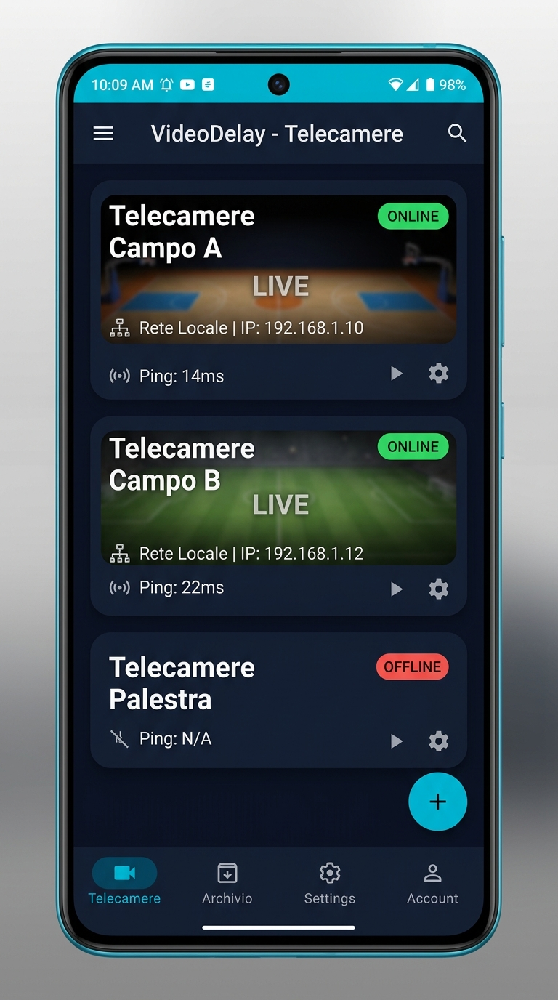
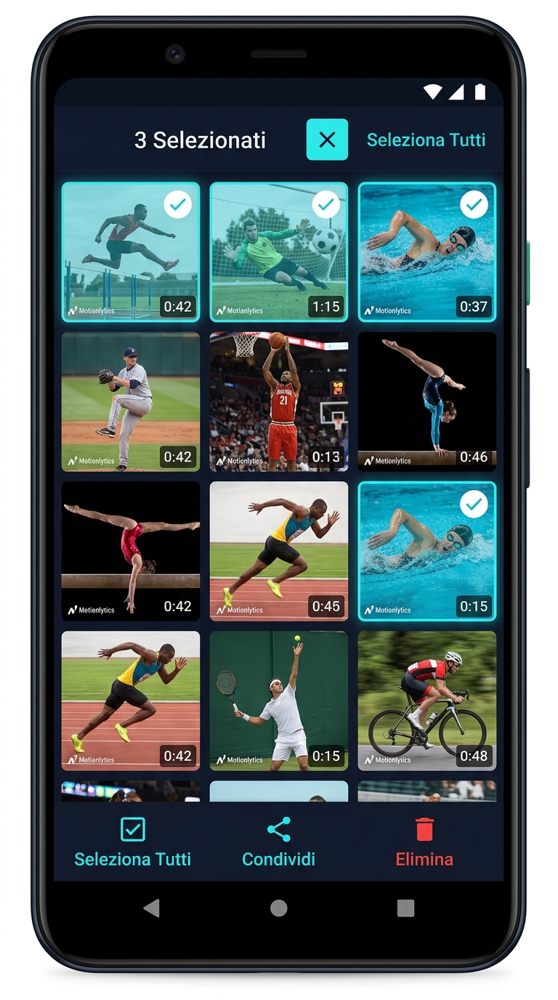
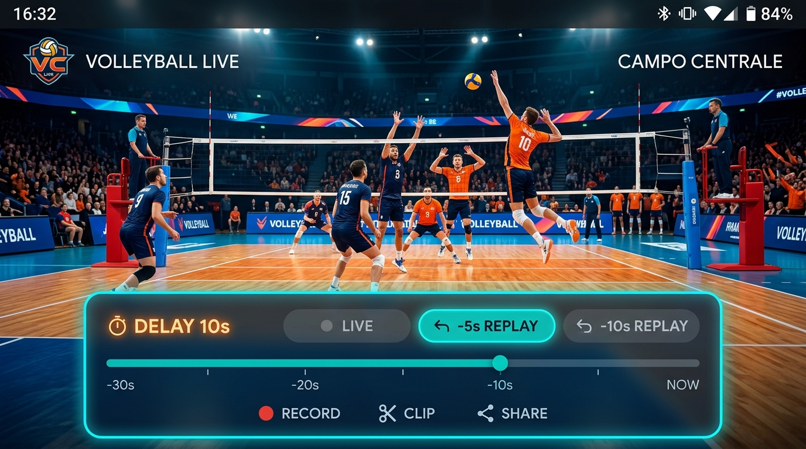

# 🎥 VideoDelay

[](https://developer.android.com/)
[](https://kotlinlang.org/)
[](https://developer.android.com/media/media3)
[](LICENSE)

**VideoDelay** è un'applicazione Android professionale progettata per l'assistenza tecnica e l'analisi tattico-sportiva a bordo campo. Consente ad allenatori, preparatori atletici e sportivi di riprodurre flussi video IP in tempo reale con un **ritardo temporale (time-shift delay)** configurabile, per revisionare i gesti tecnici immediatamente dopo la loro esecuzione.

---

## 📱 Screenshots & Interfaccia (Cyber Teal)

<p align="center">
  
  &nbsp;&nbsp;&nbsp;&nbsp;
  
</p>

<p align="center">
  
</p>

---

## ✨ Funzionalità Principali

### ⏱️ Time-Shift & Delay Configurabile
- **Differita Personalizzabile**: Imposta il ritardo desiderato (es. 5s, 10s, 20s, 30s) per consentire all'atleta di finire l'esercizio e guardare subito il monitor.
- **Replay Istantaneo**: Tasti rapidi per riavvolgere al volo gli ultimi secondi dell'azione.
- **Timeline Interattiva**: Navigazione fluida lungo tutto il buffer di memoria registrato.
- **Servizio in Foreground (`StreamingForegroundService`)**: Garantisce la registrazione continua e stabile del buffer anche con app in background.

### 📹 Gestione Fotocamere & Streaming IP Direct
- **Supporto Streaming Reale**: Connessione diretta a telecamere IP con protocolli **RTSP** (`rtsp://`) e **HLS** (`http://`, `https://`).
- **Mappatura Flusso Video Sicura**: Estrazione nativa del flusso video (`-map 0:v:0 -c:v copy`) che previene crash del muxer HLS causati da codec audio non supportati (es. G.711 PCMA/PCMU).
- **Scanner QR Code Integrato**: Scansiona il codice QR di una videocamera IP per aggiungerla all'istante.
- **Monitoraggio Latenza (Ping)**: Verifica in tempo reale la qualità della connessione di ogni telecamera con indicatori di ping in millisecondi.

### 🏐 Modalità Demo Pallavolo (Vista da Dietro la Linea di Fondo)
- **Scena Prospettica 3D**: Riproduce un campo da pallavolo completo visto dalla linea di fondo (dietro il campo di casa) con parquet blu/arancione, righe laterali, linea dei 3 metri e rete frontale con aste/antenne regolamentari rosse e bianche.
- **Rally Dinamico del Pallone (180s)**: Durata di 3 minuti (180s) con traiettoria animata del pallone a tre colori che passa continuamente da un campo all'altro scavalcando la rete e variando l'angolo di attacco tra le aste ad ogni rimbalzo (diagonali, attacchi centrali, lungolinea).
- **Salvataggio Permanente (`filesDir`)**: Il file `demo_video.mp4` viene generato una volta sola nella memoria interna e caricato all'istante (1 ms) a ogni avvio dell'app senza venire mai più rigenerato.

### 📸 Cattura Screenshot & Editor Tecnico
- **Cattura Pulita (Clean Capture)**: Durante la cattura dello screenshot, l'interfaccia (HUD, loghi e pannelli) viene nascosta per una frazione di secondo, estraendo il frame video nativo a risoluzione piena.
- **Editor di Disegno Integrato**: Strumento per disegnare a mano libera, tracciare linee e aggiungere note tecniche direttamente sul fermo immagine.

### 🖼️ Galleria, Partite & Gestione Avanzata Immagini
- **Organizzazione per Partita / Sessione (`MatchManager`)**: Crea e seleziona cartelle specifiche per ogni gara o allenamento (es. `Partita vs Roma`). Tutti gli screenshot e le clip registrate vengono salvati direttamente nella sottocartella della partita attiva.
- **Pulsante "➕ Nuova Partita"**: Avvia una nuova sessione con un tocco per lasciare le cartelle precedenti pulite e separate.
- **Eliminazione In blocco per Partita ("🗑️ Elimina Partita")**: Cancella l'intera cartella della partita selezionata e tutti i suoi file multimediali in un'unica operazione.
- **Pulsanti Scout 5 Colonne**: Popup MARK riprogettato su 5 colonne distinte con codifica scout completa:
  - **P.4**: `4.H`, `4.V`
  - **P.3**: `3.F`, `3.1`, `3.2`, `3.7`
  - **P.2**: `2.H`, `2.V`
  - **P.1**: `1.0`, `1.G` (separati da P e O)
  - **P/O**: `P` (Pipe) e `O` (Opposto)
- **Selettore Durata Orologio Invertito**: Pulsante orologio `⏱️ 3s` posizionato in vista a sinistra nell'intestazione del popup per la selezione immediata della durata clip.
- **Modalità Selezione Multipla & Scoped Storage**: Selezione multipla, condivisione ed eliminazione conforme ad Android 11+ tramite `MediaStore.createDeleteRequest`.

### 🎨 Design System "Cyber Teal"
- **Tema Scuro Tecnologico**: Sfondo Navy scuro (`#0F172A`) e superfici Blu Tech (`#192134`) con accenti Ciano (`#06B6D4`) e Teal (`#0EA5E9`).
- **Supporto Window Insets (`fitsSystemWindows`)**: Layout ottimizzato per evitare sovrapposizioni con notch, fotocamera frontale o barra delle notifiche di sistema sia in modalità Verticale che Orizzontale.

---

## 🛠️ Architettura & Tecnologie

| Componente | Tecnologia / Libreria |
| --- | --- |
| **Linguaggio** | Kotlin |
| **Min SDK** | API 24 (Android 7.0) |
| **Target SDK** | API 34+ (Android 14) |
| **Media Engine** | AndroidX Media3 / ExoPlayer & FFmpegKit |
| **QR Scanner** | ZXing Embedded |
| **Async Tasks & State** | Kotlin Coroutines, LiveData, ViewModel |
| **UI Components** | Material Components, ConstraintLayout, ViewBinding |

---

## 🚀 Istruzioni di Compilazione

### Prerequisiti
- Android Studio Hedgehog (2023.1.1) o superiore
- JDK 17
- Android SDK 34

### Comandi Gradle Rapidi
```bash
# Verifica compilazione Kotlin
.\gradlew compileDebugKotlin

# Generazione APK Debug
.\gradlew assembleDebug

# Generazione APK Release firmato
.\gradlew assembleRelease
```
L'APK compilato si troverà in: `app/build/outputs/apk/release/app-release.apk`

---

## 📄 Licenza

Questo progetto è distribuito sotto licenza MIT. Per maggiori informazioni consulta il file [LICENSE](LICENSE).
